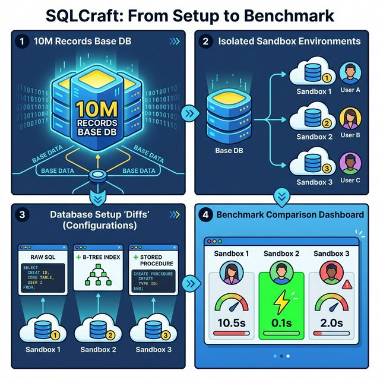

# SQLCraft

**Master SQL — from correctness to performance.**

SQLCraft is an open-source SQL platform for sandboxed query execution, realistic datasets, execution-plan analysis, and admin-reviewed content workflows.
<p align="center">
  
</p>

## Features

- **SQL Lab** — Browser-based SQL editor with execution plans, query history, and result comparison.
- **Isolated Sandboxes** — Each session gets a dedicated PostgreSQL container, auto-cleaned on expiry.
- **Dataset Scaling** — Same schema across 4 scales (100 → 10M+ rows) to reveal real performance differences.
- **Optimization Labs** — Side-by-side query benchmarking with index management and schema diff.

## Tech Stack

| Layer | Technology |
|---|---|
| Frontend | Next.js 16 (App Router), TypeScript, Tailwind CSS |
| Backend API | Fastify, TypeScript, Drizzle ORM |
| Worker | Node.js, BullMQ |
| Database | PostgreSQL 16 |
| Cache / Queue | Redis 7 |
| Storage | MinIO (S3-compatible) |
| Monorepo | pnpm workspaces + Turborepo |
| Containers | Docker + Docker Compose |

## Databases

**Today:** the stack is built around **PostgreSQL** for both metadata and learner sandboxes.

**PostgreSQL vs other engines** (MySQL, MariaDB, SQLite, SQL Server, …): **in progress** — those dialects are not available in sandboxes or the Lab yet; work to support additional engines is ongoing. Until then, assume **PostgreSQL-only** for SQL execution, `EXPLAIN`, and plan tooling.

## Quick Start

### Prerequisites

- Docker + Docker Compose

### 1) One-command install (recommended)

```bash
bash <(curl -fsSL https://raw.githubusercontent.com/thaonv7995/SQLCraft/main/install.sh)
```

What `./install.sh` does:

- Generates/updates `.env.production` from `.env.production.example`
- Auto-generates secrets (`JWT_SECRET`, DB/storage/sandbox passwords)
- Prompts for first admin (or uses defaults)
- Bootstraps DB (`migrate` + `seed`)
- Builds and starts production images (`api`, `web`, `worker`)

After startup:

- **Web**: http://localhost:13029
- **API**: http://localhost:4000
- **MinIO Console**: http://localhost:9001
- First admin credentials are printed in terminal

### 2) Useful production commands

```bash
make prod         # Start production stack (no rebuild)
make prod-stop    # Stop production stack
make prod-logs    # Tail production logs
make prod-clean   # Stop + remove production volumes
make release-docker  # Build production images only
```

### 3) Manual path (without installer)

If you prefer manual setup:

```bash
make prod-build
```

### Development (optional)

If you want local development with hot-reload:

```bash
make setup
make dev
```

Dev URLs:

- **Web**: http://localhost:13029
- **API**: http://localhost:4000

### Docker (dev images)

`docker-compose.dev.yml` builds **api**, **web**, and **worker** from `Dockerfile.dev`. Those Dockerfiles copy **`pnpm-lock.yaml`** and run **`pnpm install --frozen-lockfile`**, so the versions inside the image match the committed lockfile. After you change any `package.json` at the repo root or in a workspace, run **`pnpm install`** at the monorepo root, commit the updated **`pnpm-lock.yaml`**, then rebuild: `docker compose -f docker-compose.dev.yml build`.

To rebuild and start the full development stack in one step:

```bash
docker compose -f docker-compose.dev.yml up --build -d
```

This brings up **postgres**, **redis**, **minio**, **api**, **web**, and **worker**.

### Production release (Docker)

Optimized images (no bind mounts) are defined in **`docker-compose.prod.yml`** with **`apps/api/Dockerfile`**, **`apps/web/Dockerfile`**, and **`services/worker/Dockerfile`**. The API container runs **migrations on startup** (`drizzle-kit migrate`) via `apps/api/docker-entrypoint.sh`.

1. Run installer:

   ```bash
   ./install.sh
   ```

2. The installer auto-creates/updates `.env.production`, ensures secrets, prompts first admin, migrates + seeds DB, then starts services.

3. Optional make targets: **`make prod`** (no rebuild), **`make prod-stop`**, **`make prod-logs`**, **`make prod-clean`** (removes volumes), **`make release-docker`** (images only).

**CI:** [`.github/workflows/docker.yml`](.github/workflows/docker.yml) runs `docker compose … build` on pushes/PRs. Tag a release as **`v*`** (e.g. `v0.1.0`) to push **`api`**, **`web`**, and **`worker`** images to **GHCR** ([`.github/workflows/release.yml`](.github/workflows/release.yml)). Pull them as `ghcr.io/<owner>/sqlcraft-api:<tag>` (same pattern for `sqlcraft-web`, `sqlcraft-worker`). Package visibility may need to be set to public in GitHub for unauthenticated pulls.

## Project Structure

```
sqlcraft/
├── apps/
│   ├── api/          # Fastify API server
│   └── web/          # Next.js 16 frontend
├── services/
│   └── worker/       # Background job worker (BullMQ)
├── packages/
│   ├── types/        # Shared TypeScript types
│   └── config/       # Shared ESLint & TS config
├── docs/             # Architecture & design docs
├── docker-compose.dev.yml
├── docker-compose.prod.yml
├── Makefile
└── turbo.json
```

## Documentation

The `docs/` directory contains comprehensive specifications and architecture decisions. Key entry points include:

- [Product Requirements (PRD)](./docs/PRD.md)
- [Architecture Overview](./docs/architecture.md)
- [Database Design](./docs/database-design.md)
- [API Specification](./docs/api-spec.md)
- [Contributing Guide](./CONTRIBUTING.md)
- [Environment Variables](./.env.example) — production: [`.env.production.example`](./.env.production.example)

## Contributing

Contributions are welcome! Please read the [Contributing Guide](./CONTRIBUTING.md) before opening a pull request.

## License

MIT — see [LICENSE](./LICENSE) for details.
