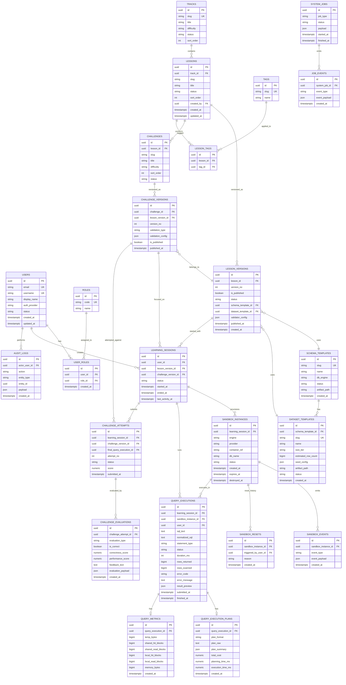

# Entity Relationship Diagram (ERD)

```mermaid
erDiagram
    USERS ||--o{ USER_ROLES : has
    ROLES ||--o{ USER_ROLES : assigned_to

    TRACKS ||--o{ LESSONS : contains
    LESSONS ||--o{ LESSON_VERSIONS : versioned_as
    LESSONS ||--o{ CHALLENGES : contains
    CHALLENGES ||--o{ CHALLENGE_VERSIONS : versioned_as

    SCHEMA_TEMPLATES ||--o{ DATASET_TEMPLATES : has
    LESSON_VERSIONS }o--|| SCHEMA_TEMPLATES : uses
    LESSON_VERSIONS }o--|| DATASET_TEMPLATES : uses
    CHALLENGE_VERSIONS }o--|| LESSON_VERSIONS : belongs_to

    USERS ||--o{ LEARNING_SESSIONS : creates
    LESSON_VERSIONS ||--o{ LEARNING_SESSIONS : started_with
    CHALLENGE_VERSIONS ||--o{ LEARNING_SESSIONS : focused_on

    LEARNING_SESSIONS ||--o{ SANDBOX_INSTANCES : provisions
    SANDBOX_INSTANCES ||--o{ SANDBOX_EVENTS : emits
    SANDBOX_INSTANCES ||--o{ SANDBOX_RESETS : reset_history

    LEARNING_SESSIONS ||--o{ QUERY_EXECUTIONS : runs
    SANDBOX_INSTANCES ||--o{ QUERY_EXECUTIONS : executes_in
    QUERY_EXECUTIONS ||--o| QUERY_EXECUTION_PLANS : has
    QUERY_EXECUTIONS ||--o| QUERY_METRICS : has

    LEARNING_SESSIONS ||--o{ CHALLENGE_ATTEMPTS : submits
    CHALLENGE_VERSIONS ||--o{ CHALLENGE_ATTEMPTS : attempted_against
    CHALLENGE_ATTEMPTS ||--o{ CHALLENGE_EVALUATIONS : evaluated_by

    LESSONS ||--o{ LESSON_TAGS : tagged
    TAGS ||--o{ LESSON_TAGS : applied_to

    USERS ||--o{ AUDIT_LOGS : performs
    SYSTEM_JOBS ||--o{ JOB_EVENTS : emits

    USERS {
      uuid id PK
      string email UK
      string username UK
      string display_name
      string auth_provider
      string status
      timestamptz created_at
      timestamptz updated_at
    }

    ROLES {
      uuid id PK
      string code UK
      string name
    }

    USER_ROLES {
      uuid id PK
      uuid user_id FK
      uuid role_id FK
      timestamptz created_at
    }

    TRACKS {
      uuid id PK
      string slug UK
      string title
      string difficulty
      string status
      int sort_order
    }

    LESSONS {
      uuid id PK
      uuid track_id FK
      string slug
      string title
      string status
      int sort_order
      uuid created_by FK
      timestamptz created_at
      timestamptz updated_at
    }

    LESSON_VERSIONS {
      uuid id PK
      uuid lesson_id FK
      int version_no
      boolean is_published
      string status
      uuid schema_template_id FK
      uuid dataset_template_id FK
      json validator_config
      timestamptz published_at
      timestamptz created_at
    }

    CHALLENGES {
      uuid id PK
      uuid lesson_id FK
      string slug
      string title
      string difficulty
      int sort_order
      string status
    }

    CHALLENGE_VERSIONS {
      uuid id PK
      uuid challenge_id FK
      uuid lesson_version_id FK
      int version_no
      string validation_type
      json validation_config
      boolean is_published
      timestamptz published_at
    }

    SCHEMA_TEMPLATES {
      uuid id PK
      string slug UK
      string name
      string db_engine
      string status
      string artifact_path
      timestamptz created_at
    }

    DATASET_TEMPLATES {
      uuid id PK
      uuid schema_template_id FK
      string slug UK
      string name
      string size_tier
      bigint estimated_row_count
      json seed_config
      string artifact_path
      string status
      timestamptz created_at
    }

    LEARNING_SESSIONS {
      uuid id PK
      uuid user_id FK
      uuid lesson_version_id FK
      uuid challenge_version_id FK
      string status
      timestamptz started_at
      timestamptz ended_at
      timestamptz last_activity_at
    }

    SANDBOX_INSTANCES {
      uuid id PK
      uuid learning_session_id FK
      string engine
      string provider
      string container_ref
      string db_name
      string status
      timestamptz created_at
      timestamptz expires_at
      timestamptz destroyed_at
    }

    SANDBOX_EVENTS {
      uuid id PK
      uuid sandbox_instance_id FK
      string event_type
      json event_payload
      timestamptz created_at
    }

    SANDBOX_RESETS {
      uuid id PK
      uuid sandbox_instance_id FK
      uuid triggered_by_user_id FK
      string reason
      timestamptz created_at
    }

    QUERY_EXECUTIONS {
      uuid id PK
      uuid learning_session_id FK
      uuid sandbox_instance_id FK
      uuid user_id FK
      text sql_text
      text normalized_sql
      string statement_type
      string status
      int duration_ms
      bigint rows_returned
      bigint rows_scanned
      string error_code
      text error_message
      json result_preview
      timestamptz submitted_at
      timestamptz finished_at
    }

    QUERY_EXECUTION_PLANS {
      uuid id PK
      uuid query_execution_id FK
      string plan_format
      text plan_raw
      json plan_summary
      numeric total_cost
      numeric planning_time_ms
      numeric execution_time_ms
      timestamptz created_at
    }

    QUERY_METRICS {
      uuid id PK
      uuid query_execution_id FK
      bigint temp_bytes
      bigint shared_hit_blocks
      bigint shared_read_blocks
      bigint local_hit_blocks
      bigint local_read_blocks
      bigint memory_bytes
      timestamptz created_at
    }

    CHALLENGE_ATTEMPTS {
      uuid id PK
      uuid learning_session_id FK
      uuid challenge_version_id FK
      uuid final_query_execution_id FK
      int attempt_no
      string status
      numeric score
      timestamptz submitted_at
    }

    CHALLENGE_EVALUATIONS {
      uuid id PK
      uuid challenge_attempt_id FK
      string evaluation_type
      boolean is_correct
      numeric correctness_score
      numeric performance_score
      text feedback_text
      json evaluation_payload
      timestamptz created_at
    }

    TAGS {
      uuid id PK
      string slug UK
      string name
    }

    LESSON_TAGS {
      uuid id PK
      uuid lesson_id FK
      uuid tag_id FK
    }

    AUDIT_LOGS {
      uuid id PK
      uuid actor_user_id FK
      string action
      string entity_type
      uuid entity_id
      json payload
      timestamptz created_at
    }

    SYSTEM_JOBS {
      uuid id PK
      string job_type
      string status
      json payload
      timestamptz started_at
      timestamptz finished_at
    }

    JOB_EVENTS {
      uuid id PK
      uuid system_job_id FK
      string event_type
      json event_payload
      timestamptz created_at
    }
```
