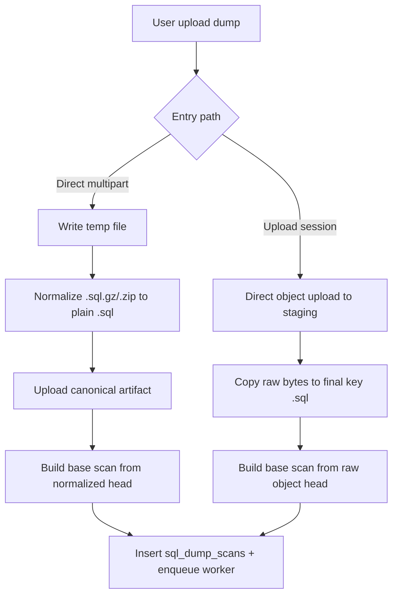

# Upload And Scan Flow

## Mục tiêu
Tài liệu này đi sâu phần đầu vào của pipeline:

- admin upload dump bằng form-data hay upload session
- API normalize file thành plain SQL hay giữ raw bytes
- API tạo base scan như thế nào
- worker scan async row-count / progress như thế nào
- các issue hiện tại trong chặng này

## Hai đường vào chính

### 1. Direct upload qua multipart

Đường này đi qua:

- `apps/api/src/modules/admin/admin.handler.ts`
- `apps/api/src/modules/admin/admin.service.ts`
- `apps/api/src/modules/admin/sql-dump-upload-format.ts`
- `apps/api/src/modules/admin/sql-dump-scan.ts`

Trình tự hiện tại:

1. `scanSqlDumpHandler()` nhận file multipart và stream xuống temp file local.
   Ref: `apps/api/src/modules/admin/admin.handler.ts:326`
2. `scanSqlDumpFromUploadedFile()` đọc head bytes, normalize `.sql.gz` hoặc `.zip` về plain `.sql` nếu cần.
   Ref: `apps/api/src/modules/admin/admin.service.ts:1129`
3. API upload canonical artifact lên MinIO bằng `uploadFileFromPath()`.
   Ref: `apps/api/src/modules/admin/admin.service.ts:1164`
4. API đọc head 12 MiB của file đã normalize để build base scan.
   Ref: `apps/api/src/modules/admin/admin.service.ts:1171`
5. API insert row vào `sql_dump_scans`, rồi enqueue `sql_dump_scan`.
   Ref: `apps/api/src/modules/admin/admin.service.ts:1181`

Điểm mạnh của đường này:

- `.sql.gz` được gunzip ra file plain SQL trước khi artifact final được lưu.
- `.zip` được extract file `.sql` bên trong trước khi scan/persist.
- artifact final vì vậy có ý nghĩa khá nhất quán với restore path phía worker.

### 2. Upload session qua presigned URL / multipart presigned parts

Đường này đi qua:

- `apps/api/src/modules/admin/sql-dump-upload-session.service.ts`
- `apps/api/src/lib/storage.ts`
- `services/worker/src/sql-dump-scan.ts`

Trình tự hiện tại:

1. `createSqlDumpUploadSession()` tạo session và staging key.
   Ref: `apps/api/src/modules/admin/sql-dump-upload-session.service.ts:49`
2. Browser upload trực tiếp object lên MinIO bằng presigned URL.
3. `completeSqlDumpUploadSession()` xác thực size / multipart parts.
   Ref: `apps/api/src/modules/admin/sql-dump-upload-session.service.ts:176`
4. API copy server-side object từ staging sang final key.
   Ref: `apps/api/src/modules/admin/sql-dump-upload-session.service.ts:265`
5. API chỉ đọc head của object final để build base scan rồi enqueue worker scan async.
   Ref: `apps/api/src/modules/admin/sql-dump-upload-session.service.ts:269`

Điểm quan trọng:

- đường này **không** normalize artifact về plain SQL trước khi persist final object
- final key luôn có dạng `admin/sql-dumps/{scanId}.sql`
- scan worker nhận thêm `fileName` gốc của user để suy luận có cần gunzip hay không

## Sơ đồ divergence giữa hai đường

## Scan async trong worker hoạt động ra sao

Worker chạy ở:

- `services/worker/src/index.ts:709`
- `services/worker/src/sql-dump-scan.ts`

Trình tự:

1. `runSqlDumpScanJob()` set status `running`.
2. Nếu không `artifactOnly`, worker đọc tối đa 64 MiB, 192 MiB, rồi 256 MiB đầu artifact để cố parse schema.
   Ref: `services/worker/src/sql-dump-scan.ts:336`
3. Worker luôn stream toàn bộ artifact qua `RowCountTransform` để đếm row và cập nhật progress.
   Ref: `services/worker/src/sql-dump-scan.ts:364`
4. Worker upload metadata sidecar JSON mới sau khi scan xong.
   Ref: `services/worker/src/sql-dump-scan.ts:389`

Phần này là chỗ đã đi đúng hướng cho file lớn:

- row count không cần load full file vào RAM
- progress bytes được cập nhật định kỳ
- artifact `.sql.gz` vẫn scan được nếu `fileName` gốc giữ đuôi `.gz`

## Issue 1: Upload session persist sai semantic của artifact nén

## Mô tả

Đây là issue nghiêm trọng nhất ở chặng đầu vào.

Code hiện tại cho phép upload:

- `.sql`
- `.txt`
- `.sql.gz`
- `.zip`

Ref: `apps/api/src/modules/admin/sql-dump-upload-session.service.ts:54`

Nhưng khi complete session:

- staging object luôn là `.../{sessionId}.sql`
- final object luôn là `.../{scanId}.sql`

Ref:

- `apps/api/src/modules/admin/sql-dump-upload-session.service.ts:69`
- `apps/api/src/modules/admin/sql-dump-upload-session.service.ts:258`

Điều này tạo ra mâu thuẫn:

- scan worker nhìn vào `fileName` gốc để biết có nên gunzip không
- restore/provision về sau lại nhìn vào `artifactUrl`/extension của object final

Ref:

- scan dùng `fileName`: `services/worker/src/sql-dump-scan.ts:32`
- restore dùng `artifactUrl` extension: `services/worker/src/dataset-loader.ts:1020`

## Tại sao `.sql.gz` còn dễ đánh lừa hơn `.zip`

### Với `.sql.gz`

Upload session path hiện có thể cho ra trải nghiệm giả "mọi thứ ổn":

1. user upload `x.sql.gz`
2. API persist object final thành `.../{scanId}.sql`
3. worker scan async vẫn gunzip được vì input job giữ `fileName = x.sql.gz`
4. row count và progress nhìn có vẻ đúng
5. import từ `scanId` tạo dataset template với `artifactUrl = s3://.../{scanId}.sql`
6. đến lúc provision, worker thấy `.sql` nên đẩy compressed bytes thẳng vào DB client

Ref:

- enqueue scan giữ `fileName` gốc: `apps/api/src/modules/admin/sql-dump-upload-session.service.ts:294`
- import giữ `artifactUrl` từ stored scan: `apps/api/src/modules/admin/admin.service.ts:799`
- restore route chọn theo extension: `services/worker/src/dataset-loader.ts:1121`

### Với `.zip`

Đường upload session hiện không có bước extract `.sql` khỏi ZIP.

So sánh:

- direct upload path có `normalizeUploadFileToPlainSqlPath()`
- upload session path chỉ copy object raw rồi đọc head range

Ref:

- normalize đúng ở direct path: `apps/api/src/modules/admin/sql-dump-upload-format.ts:237`
- upload session không gọi normalize: `apps/api/src/modules/admin/sql-dump-upload-session.service.ts:263`

Vì vậy `.zip` qua upload session gần như hỏng end-to-end:

- head scan đọc vào bytes ZIP
- row count scanner stream bytes ZIP, không phải SQL
- restore về sau cũng nhận bytes ZIP nhưng tưởng là `.sql`

## Biểu hiện runtime dự kiến

- scan có thể vẫn tạo `scanId`
- `totalRows` có thể bằng 0 hoặc sai
- import canonical có thể vẫn thành công nếu admin không để ý
- sandbox provision / golden bake fail muộn ở worker
- lỗi xuất hiện xa thời điểm upload nên khó quy nguyên nhân

## Vì sao issue này nặng hơn khi file vài GB

- user mất nhiều thời gian upload xong mới phát hiện pipeline fail
- worker scan cả object lớn mới kết thúc và mới lộ lỗi ở bước sau
- chi phí retry cao vì artifact persisted sai ngay từ đầu
- nếu dataset được publish rồi mới đụng provision/golden bake thì blast radius lớn hơn một lỗi validation sớm

## Đánh giá

- mức độ: cao
- bản chất: logic consistency bug, không phải optimization bug
- ưu tiên sửa: cao nhất trong nhóm issue hiện tại

## Hướng sửa khuyến nghị

### Phương án khuyến nghị

Chuẩn hóa upload session giống direct upload:

1. decode `.sql.gz` về plain `.sql`
2. extract `.zip` sang `.sql`
3. lưu artifact final ở dạng canonical plain SQL
4. metadata sidecar và `artifactUrl` về sau đều trỏ đúng semantic

Lợi ích:

- restore/provision không cần biết artifact ban đầu là `.gz` hay `.zip`
- scan và restore nhìn cùng một artifact
- behavior giữa hai entry path trở nên đồng nhất

### Phương án thay thế

Giữ raw artifact nhưng phải:

- lưu format thật của artifact
- dạy restore path đọc metadata chứ không suy theo extension object key
- xử lý `.zip` như first-class artifact type

Phương án này phức tạp hơn đáng kể vì đụng nhiều service.

## Issue 2: Một số helper scan cũ vẫn giữ khả năng đọc full object

Trong `apps/api/src/modules/admin/sql-dump-scan.ts` vẫn còn nhánh cũ:

- `readFile(filePath)`
- `readFullObject(stagingObjectKey)`

Ref:

- `apps/api/src/modules/admin/sql-dump-scan.ts:1682`
- `apps/api/src/modules/admin/sql-dump-scan.ts:1702`
- `apps/api/src/modules/admin/sql-dump-scan.ts:1795`
- `apps/api/src/modules/admin/sql-dump-scan.ts:1817`

Ý nghĩa:

- current primary flow đã né phần này trong đường upload session mới
- nhưng nếu ai tái sử dụng helper cũ hoặc route nội bộ khác quay lại nhánh này, API vẫn có thể load full dump vào RAM theo ngưỡng config rất lớn

Rủi ro vận hành:

- `SQL_DUMP_FULL_PARSE_MAX_MB` default ở API đang là `5120`
- nghĩa là về mặt config, API sẵn sàng thử full parse dump nhiều GB nếu route đó được dùng

Ref: `apps/api/src/lib/config.ts:69`

Đây là latent risk, chưa phải bug runtime chắc chắn trong flow chính hiện tại.

## Issue 3: Row-count scanner không flush `carry` cuối stream

Cả 2 scanner hiện đều giữ `carry = lines.pop() ?? ''` nhưng không có bước flush phần còn lại ở cuối file:

- worker async scan: `services/worker/src/sql-dump-scan.ts`
- API worker thread rowcount: `apps/api/src/modules/admin/sql-dump-rowcount.worker.ts`

Ref:

- `services/worker/src/sql-dump-scan.ts:81`
- `apps/api/src/modules/admin/sql-dump-rowcount.worker.ts:128`
- `apps/api/src/modules/admin/sql-dump-rowcount.worker.ts:195`

Tác động:

- nếu file không kết thúc bằng newline
- hoặc statement cuối cùng nằm trọn trong `carry`
- scanner có thể bỏ sót row cuối hoặc statement cuối

Mức độ:

- thấp hơn 2 issue trên
- nhưng là correctness bug thật sự, đặc biệt với dumps sinh bởi tool không luôn kết thúc bằng newline

## Checklist fix cho chặng upload/scan

- hợp nhất canonicalization giữa direct upload và upload session
- không persist raw `.sql.gz` hoặc `.zip` dưới object key `.sql`
- thêm test cho upload session với `.sql.gz`
- thêm test cho upload session với `.zip`
- flush `carry` cuối stream cho cả hai row-count scanner
- hạ vai trò của full-parse helpers cũ hoặc giảm ngưỡng mặc định ở nơi còn dùng
