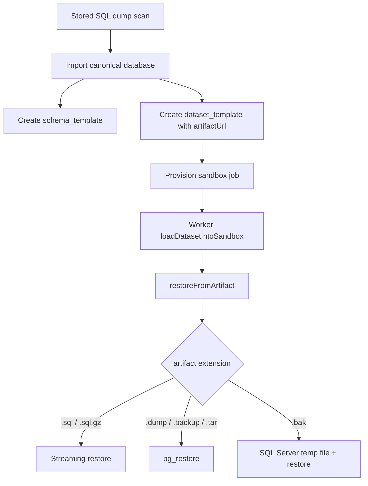

# Import And Provision Flow

## Mục tiêu
Tài liệu này mô tả chặng giữa:

- từ `scanId` sang `schema_templates` và `dataset_templates`
- từ `dataset_templates.artifact_url` sang sandbox restore thực tế
- cách extension artifact điều khiển logic restore
- vì sao format consistency của artifact ảnh hưởng trực tiếp tới phần provision

## Luồng tổng quát

## Chặng import từ `scanId`

Code chính:

- `apps/api/src/modules/admin/admin.service.ts:667`

Trình tự:

1. `importCanonicalDatabaseFromSqlDumpScan()` load stored scan metadata.
2. Nó lấy `storedScan.artifactUrl` và gắn thẳng vào canonical dataset.
3. Sau đó persist `schema_templates` và `dataset_templates`.

Ref:

- load scan: `apps/api/src/modules/admin/admin.service.ts:678`
- giữ `sourceArtifactUrl` trong metadata: `apps/api/src/modules/admin/admin.service.ts:799`
- canonical dataset nhận `artifactUrl`: `apps/api/src/modules/admin/admin.service.ts:805`
- `dataset_templates.artifactUrl` được ghi xuống DB: `apps/api/src/modules/admin/admin.service.ts:981`

Ý nghĩa quan trọng:

`storedScan.artifactUrl` là nguồn sự thật cho toàn bộ restore về sau.

Nếu stored scan trỏ tới artifact có semantic sai, toàn bộ sandbox provision và golden bake đều kế thừa sai đó.

## Chặng provision sandbox

Worker đi qua:

- `services/worker/src/index.ts`
- `services/worker/src/sandbox-apply-dataset.ts`
- `services/worker/src/dataset-loader.ts`

Trình tự:

1. worker resolve engine từ `schema_templates.dialect` / `engine_version`
2. tạo sandbox container
3. `applySchemaAndDatasetToContainer()`
4. `loadDatasetIntoSandbox()`
5. `restoreFromArtifact()`

Ref:

- create/provision job: `services/worker/src/index.ts:360`
- apply shared logic: `services/worker/src/sandbox-apply-dataset.ts:48`
- load dataset: `services/worker/src/dataset-loader.ts:1261`

## Restore được route bằng extension

Trong `restoreFromArtifact()`, logic dispatch format hiện dựa vào `artifactUrl`:

- `.sql`
- `.sql.gz`
- `.dump`
- `.backup`
- `.tar`
- `.bak`

Ref:

- extension dispatch: `services/worker/src/dataset-loader.ts:1020`
- route `.sql/.sql.gz`: `services/worker/src/dataset-loader.ts:1130`
- route `.bak`: `services/worker/src/dataset-loader.ts:1204`
- route `pg_restore`: `services/worker/src/dataset-loader.ts:1234`

Điều này làm artifact consistency trở thành điều kiện tiên quyết:

- artifact extension phải phản ánh đúng bytes thật sự
- nếu không, worker sẽ chọn sai DB client hoặc sai transform

## Per-engine behavior với dump lớn

## PostgreSQL

### `.sql` / `.sql.gz`

- stream từ source
- nếu `.gz` thì gunzip on the fly
- đi qua `createPostgresSanitizeTransform()`
- pipe vào `psql`

Ref: `services/worker/src/dataset-loader.ts:1168`

Ưu điểm:

- không cần load full file vào RAM worker
- phù hợp cho dump rất lớn

### `.dump` / `.backup` / `.tar`

- stream vào `pg_restore`

Ref: `services/worker/src/dataset-loader.ts:1234`

Ghi chú:

- restore path này khá tốt
- nhưng golden snapshot generation phía PostgreSQL hiện vẫn dump ra file local trước khi upload, nên bottleneck lớn lại nằm ở bake chứ không nằm ở restore

## MySQL / MariaDB

### `.sql` / `.sql.gz`

Luồng này có đặc điểm riêng:

1. pass 1 scan stream để xem có cần rewrite `USE db`, `CREATE DATABASE`, prefix `db.table` hay không
2. pass 2 mới stream thật vào `mysql`/`mariadb`

Ref: `services/worker/src/dataset-loader.ts:1130`

Ưu điểm:

- không buffer toàn bộ dump

Trade-off:

- chi phí I/O xấp xỉ 2 lần artifact size
- với HTTP source còn phải download một lần ra temp file local rồi mới đọc 2 pass từ disk

Ref: `services/worker/src/dataset-loader.ts:920`

Điều đó có nghĩa:

- file vài GB vẫn có thể chạy
- nhưng provision time sẽ bị đội lên đáng kể nếu dump cần rewrite hoặc source là HTTP

## SQL Server

### `.sql` / `.sql.gz`

- stream source
- optional gunzip
- sanitize bằng `createSqlServerSanitizeTransform()`
- pipe vào `sqlcmd`

Ref: `services/worker/src/dataset-loader.ts:1187`

Ưu điểm:

- không cần temp file cho `.sql`

### `.bak`

- download/stream object xuống local temp file
- `docker cp` file đó vào container
- chạy `RESTORE DATABASE`

Ref: `services/worker/src/dataset-loader.ts:1204`

Đây là nhánh tốn disk tạm nhiều nhất khi restore.

## Timeout trong provision

Provision path đã có dynamic timeout khá hợp lý:

- baseline từ `SANDBOX_DATASET_RESTORE_TIMEOUT_MS`
- nếu biết `artifactByteSize`, worker scale timeout theo size và engine

Ref:

- `services/worker/src/index.ts:269`
- `services/worker/src/index.ts:309`

Điểm tốt:

- với artifact nằm trên S3/MinIO, dynamic timeout hoạt động được
- direct upload/import flow trong repo hiện chủ yếu rơi vào nhóm này

Điểm còn hở:

- helper resolve size hiện chủ yếu hỗ trợ `s3://` và inline SQL
- artifact HTTP/local path không luôn được estimate tốt bằng cùng cơ chế

## Issue chính trong chặng này

## Issue A: Import path quá tin `storedScan.artifactUrl`

Về mặt kiến trúc, import path đang đúng vì nó tin vào output của scan.

Vấn đề là nếu scan path persist artifact sai semantic thì import không có tầng bảo vệ thứ hai.

Hiện không có bước:

- sniff bytes để xác nhận artifact format trước khi lưu dataset template
- hoặc canonicalize lại artifact trước khi import

Hệ quả:

- bug ở upload/scan path đi thẳng vào provision path
- càng về sau càng khó sửa vì dataset template đã được tạo rồi

## Issue B: Restore selection dựa hoàn toàn vào extension

Đây là thiết kế đơn giản và dễ hiểu, nhưng có 2 hệ quả:

1. artifact key không được phép nói dối về format
2. mọi service tạo artifact phải dùng cùng quy ước naming

Trong repo hiện tại:

- direct upload path phần lớn tuân thủ được
- upload session path thì chưa
- golden snapshot path thì có quy ước naming rõ hơn: `.dump`, `.sql.gz`, `.bak`

## Issue C: SQL Server `.bak` restore và temp disk

Ngay cả khi artifact format đúng, SQL Server vẫn có độ nhạy cao hơn:

- restore cần local temp file trước
- rồi `docker cp` vào container

Với snapshot/bak vài GB, resource pressure sẽ đi vào:

- disk host/container
- thời gian copy file
- thời gian restore I/O

Nó không phải bug logic, nhưng là constraint vận hành thật sự.

## Kết luận cho chặng import/provision

- nếu artifact là canonical plain SQL hoặc đúng snapshot format, provision path hiện nay đủ tốt để xử lý file lớn hơn trước rất nhiều
- bottleneck chính nằm ở I/O, timeout, và disk, không còn nằm hoàn toàn ở RAM
- tuy vậy, chặng này phụ thuộc tuyệt đối vào việc artifact từ scan path phải đúng semantic

## Đề xuất

- thêm validation trước khi import từ `scanId` để xác nhận `storedScan.artifactUrl` và `fileName` không mâu thuẫn
- giữ một trường metadata rõ ràng hơn cho `artifactFormat`
- nếu tiếp tục dùng extension dispatch, mọi path tạo artifact phải canonicalize trước khi persist
- với SQL Server `.bak`, bổ sung preflight check cho free disk hoặc ít nhất ghi log cảnh báo rõ hơn trước khi restore
