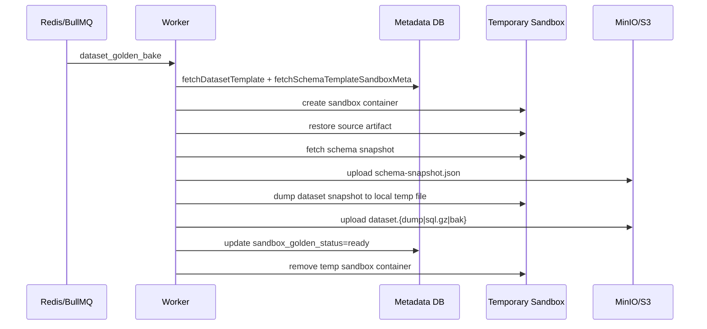

# Golden Snapshot Flow

## Mục tiêu
Tài liệu này tập trung riêng vào pipeline golden snapshot:

- khi nào job được enqueue
- worker restore source artifact vào sandbox bake thế nào
- snapshot và schema snapshot được tạo ra sao
- với dump vài GB thì chỗ nào chịu được, chỗ nào còn rủi ro

## Luồng bake hiện tại

Code chính:

- `services/worker/src/dataset-golden-bake.ts`
- `services/worker/src/golden-bake-snapshot.ts`
- `services/worker/src/dataset-loader.ts`

Trình tự:

1. API/worker đánh dấu dataset `sandbox_golden_status = pending`
2. BullMQ chạy job `dataset_golden_bake`
3. worker gọi `runDatasetGoldenBake()`
4. worker chạy `runGoldenBakeSnapshotPipeline()`
5. pipeline tạo sandbox tạm
6. restore source artifact vào sandbox đó
7. chụp schema snapshot JSON
8. dump logical snapshot hoặc backup file
9. upload snapshot lên MinIO/S3
10. update `dataset_templates` sang `ready`

## Sequence diagram

## Worker restore source artifact

Golden bake không restore từ golden snapshot cũ.

Nó luôn ép:

- `preferArtifactOverGoldenSnapshot: true`

Ref: `services/worker/src/golden-bake-snapshot.ts:236`

Ý nghĩa:

- bake luôn dùng source artifact gốc làm nguồn sự thật
- tránh bake lồng nhiều tầng snapshot lên nhau

Đây là quyết định đúng về mặt dữ liệu.

## Tạo schema snapshot

Sau khi restore xong, worker gọi `fetchSandboxSchemaSnapshotForEngine()` rồi upload JSON lên object storage.

Ref:

- fetch snapshot: `services/worker/src/golden-bake-snapshot.ts:245`
- upload schema JSON: `services/worker/src/golden-bake-snapshot.ts:254`

Mục đích:

- cung cấp base cho schema diff khi query worker so sánh sandbox hiện tại với snapshot ban đầu

Phần này không tốn nhiều tài nguyên vì object nhỏ.

## Tạo dataset snapshot theo engine

## PostgreSQL

Worker tạo file local:

- `snap.dump`

Rồi gọi `pg_dump -Fc`.

Ref: `services/worker/src/golden-bake-snapshot.ts:272`

Ưu điểm:

- output compact
- restore về sau qua `pg_restore` khá thuận tiện

Trade-off:

- snapshot phải materialize đầy đủ ra temp file local trước khi upload

## MySQL / MariaDB

Worker tạo file local:

- `snap.sql.gz`

Rồi dump logical SQL và gzip ngay trong lúc dump.

Ref: `services/worker/src/golden-bake-snapshot.ts:292`

Ưu điểm:

- snapshot là format dễ stream lúc restore
- gzip giúp giảm object size

Trade-off:

- vẫn cần temp file local đầy đủ trước khi upload

## SQL Server

Worker tạo file local:

- `snap.bak`

Rồi gọi `BACKUP DATABASE`.

Ref: `services/worker/src/golden-bake-snapshot.ts:282`

Trade-off:

- `.bak` là format tự nhiên của engine
- nhưng là nhánh nặng nhất về disk và copy time

## Điểm mạnh hiện tại

## 1. Restore source artifact đã tốt hơn trước

Pipeline bake tận dụng `applySchemaAndDatasetToContainer()`, nên source artifact `.sql` / `.sql.gz` đã được restore theo hướng streaming ở nhiều engine.

Ref: `services/worker/src/golden-bake-snapshot.ts:224`

Tức là:

- stage đầu của bake đã tránh được kiểu OOM do load full dump vào RAM worker

## 2. Upload snapshot lên object storage là streaming từ file

Sau khi file local đã tồn tại, upload dùng:

- `uploadFileToS3ViaMinioStreaming()`

Ref:

- call site: `services/worker/src/golden-bake-snapshot.ts:308`
- implementation: `services/worker/src/docker.ts:1057`

Phần upload không phải điểm yếu chính.

## Issue 1: Local temp disk mới là bottleneck chính của bake

Đây là điểm quan trọng nhất khi hỏi "với dump vài GB thì golden snapshot xử lý được không?".

Trả lời ngắn:

- có thể xử lý được
- nhưng điều kiện là host phải đủ disk tạm và I/O

Lý do:

1. source artifact restore cần disk của sandbox engine
2. sau đó worker còn dump thêm một snapshot file đầy đủ trong `tmpdir()`
3. hai thứ này tồn tại chồng lên nhau trong cùng khoảng thời gian

Ref:

- tạo `tmpDir`: `services/worker/src/golden-bake-snapshot.ts:268`
- dump file local: `services/worker/src/golden-bake-snapshot.ts:272`
- upload file local: `services/worker/src/golden-bake-snapshot.ts:308`

Tác động thực tế:

- dataset 5 GB không chỉ "tốn 5 GB"
- còn phải tính thêm data volume của sandbox đang chạy và overhead của engine
- SQL Server thường nặng nhất vì `.bak` lớn và restore/backup I/O cao

## Issue 2: Timeout bake hiện là timeout tĩnh

Golden bake dùng:

- `GOLDEN_BAKE_RESTORE_TIMEOUT_MS`
- default 45 phút nếu không override

Ref: `services/worker/src/golden-bake-snapshot.ts:32`

Trong khi provision path bình thường đã có dynamic timeout theo artifact size.

Ref:

- dynamic timeout logic: `services/worker/src/index.ts:269`
- apply timeout: `services/worker/src/index.ts:309`

Điều này tạo ra chênh lệch:

- cùng một artifact vài GB
- provision sandbox thường có estimate mềm hơn
- nhưng golden bake có thể fail chỉ vì timeout tĩnh, dù host vẫn đang xử lý đúng

## Issue 3: SQL Server snapshot consume path vẫn cần temp file lần nữa

Sau khi bake xong `.bak`, lần restore từ golden snapshot về sau đi qua:

1. stream object từ storage xuống local temp file
2. `docker cp` vào container
3. `RESTORE DATABASE`

Ref: `services/worker/src/dataset-loader.ts:1205`

Nghĩa là SQL Server không chỉ đắt ở lúc bake, mà cả lúc consume snapshot cũng đắt hơn Postgres/MySQL.

## Issue 4: Không có preflight check cho free disk / bake concurrency

Mình chưa thấy logic nào:

- kiểm tra free space trước khi dump snapshot
- giới hạn số golden bake nặng chạy đồng thời theo disk budget
- ước lượng snapshot amplification trước khi start

Điều này không làm code sai logic, nhưng là thiếu guardrail vận hành.

Với nhiều dataset lớn chạy song song, failure mode có thể là:

- hết disk
- I/O contention nặng
- timeout giả do host chậm đi

## Đánh giá theo engine khi artifact vài GB

| Engine | Restore source artifact | Bake snapshot | Rủi ro chính |
|---|---|---|---|
| PostgreSQL | Tốt, stream được | Dump local `.dump` | temp disk + timeout |
| MySQL/MariaDB | Tốt, stream được nhưng 2 pass | Dump local `.sql.gz` | I/O và thời gian dump |
| SQL Server | `.sql` stream được, `.bak` cần temp | Backup local `.bak` | temp disk, copy time, restore time |

## Kết luận

Golden snapshot hiện không còn là "không thể làm với dump lớn", nhưng cũng chưa ở mức "native large artifact pipeline".

Nó đang ở trạng thái:

- logic dữ liệu khá tốt
- restore source artifact khá tốt
- nhưng bake snapshot vẫn phụ thuộc mạnh vào local temp disk và timeout tĩnh

## Đề xuất

- thêm dynamic timeout cho golden bake giống provision path
- thêm preflight log hoặc hard check cho dung lượng disk trước khi bake
- cân nhắc stream trực tiếp dump output lên object storage thay vì luôn đi qua file local
- ít nhất với SQL Server, bổ sung metrics/log rõ hơn cho thời gian backup, kích thước `.bak`, và thời gian upload
