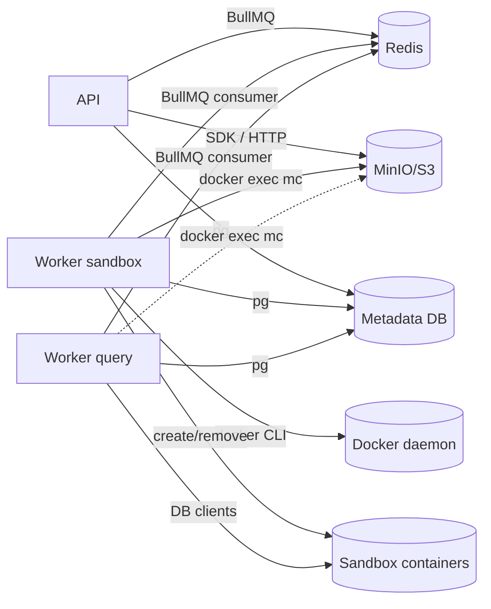

# Service Connectivity

## Mục tiêu
Tài liệu này gom toàn bộ phần "connect giữa các service":

- service nào đang kết nối sang service nào
- dùng protocol / tool gì
- config nào quyết định đường kết nối
- điểm nào đang nhất quán
- điểm nào đang lệch giữa `api`, `worker`, và `worker-query`

## Thành phần chính

- `apps/api`
- `services/worker` với `WORKER_ROLE=sandbox`
- `services/worker` với `WORKER_ROLE=query`
- PostgreSQL metadata DB
- Redis/BullMQ
- MinIO/S3
- Docker daemon
- sandbox containers

## Ma trận kết nối hiện tại

| Producer | Consumer | Mục đích | Cơ chế hiện tại | File chính |
|---|---|---|---|---|
| API | PostgreSQL metadata | đọc/ghi metadata | `pg` / Drizzle | `apps/api/src/db`, `apps/api/src/lib/config.ts` |
| API | Redis/BullMQ | enqueue job | BullMQ + ioredis | `apps/api/src/lib/queue.ts` |
| API | MinIO/S3 | upload scan artifact, presign, read head | MinIO SDK qua HTTP | `apps/api/src/lib/storage.ts` |
| Worker sandbox | PostgreSQL metadata | fetch/update dataset, sandbox, job state | `pg` | `services/worker/src/db.ts` |
| Worker sandbox | Redis/BullMQ | consume jobs | BullMQ + ioredis | `services/worker/src/index.ts` |
| Worker sandbox | Docker daemon | create/remove sandbox containers | `docker` CLI | `services/worker/src/docker.ts` |
| Worker sandbox | MinIO/S3 | stream artifact, upload snapshot | `docker exec` vào container MinIO + `mc` | `services/worker/src/docker.ts` |
| Worker query | PostgreSQL metadata | query metadata + persist result | `pg` | `services/worker/src/db.ts` |
| Worker query | Redis/BullMQ | consume query jobs | BullMQ + ioredis | `services/worker/src/index.ts` |
| Worker query | Sandbox DB | execute query, schema diff | direct DB client | `services/worker/src/query-executor.ts` |
| Worker query | MinIO/S3 | đọc golden schema snapshot | hiện cũng qua `docker exec` vào MinIO | `services/worker/src/index.ts`, `services/worker/src/docker.ts` |

## Sơ đồ wiring mức cao

## Kết nối API -> storage đang khá sạch

API dùng MinIO client trực tiếp:

- `makeClient(config.STORAGE_ENDPOINT)`
- `getObject`, `putObject`, `copyObject`, `getPartialObject`

Ref: `apps/api/src/lib/storage.ts:13`

Điểm tốt:

- không phụ thuộc Docker socket
- không phụ thuộc tên container runtime
- phù hợp cho cả local lẫn production

## Kết nối worker sandbox -> storage đang trộn CLI sidecar

Worker dùng `docker exec` vào container MinIO, rồi chạy `mc cat`, `mc pipe`, `mc stat`.

Ref:

- `services/worker/src/docker.ts:1013`
- `services/worker/src/docker.ts:1028`
- `services/worker/src/docker.ts:1041`
- `services/worker/src/docker.ts:1111`
- `services/worker/src/docker.ts:1134`

Điều này hoạt động được với `worker` sandbox vì service này:

- có `docker-cli` trong image
- có mount `/var/run/docker.sock`

Ref:

- image cài docker-cli: `services/worker/Dockerfile:3`
- compose mount docker.sock dev: `docker-compose.dev.yml:149`
- compose mount docker.sock prod: `docker-compose.prod.yml:124`

Với sandbox worker, đây là một lựa chọn vận hành được, dù không phải cách gọn nhất.

## Issue chính: worker-query đọc storage bằng cơ chế mà nó không sở hữu

Trong query path, worker cố đọc golden schema snapshot bằng:

- `readS3ArtifactBuffer()`

Ref: `services/worker/src/index.ts:789`

Nhưng `readS3ArtifactBuffer()` lại phụ thuộc `docker exec` vào MinIO container:

- `services/worker/src/docker.ts:1161`

Đây là điểm lệch lớn giữa design và runtime:

- `worker-query` không mount Docker socket
- prod `worker-query` còn không set `STORAGE_DOCKER_CONTAINER`

Ref:

- dev `worker-query` không có docker.sock: `docker-compose.dev.yml:163`
- dev có set `STORAGE_DOCKER_CONTAINER`, nhưng vẫn không có docker.sock: `docker-compose.dev.yml:179`
- prod `worker-query` không có docker.sock: `docker-compose.prod.yml:138`
- prod cũng không set `STORAGE_DOCKER_CONTAINER`: `docker-compose.prod.yml:146`

Nghĩa là:

- code đường đọc storage của `worker-query` giả định runtime giống `worker` sandbox
- nhưng compose lại triển khai `worker-query` như một service nhẹ, không có Docker access

## Failure mode hiện tại

May là code có fallback:

- nếu load golden schema snapshot lỗi thì log warning
- sau đó dùng template base thay thế

Ref: `services/worker/src/index.ts:795`

Điều này tránh outage hoàn toàn, nhưng gây silent degradation:

- query execution vẫn chạy
- schema diff vẫn có output
- nhưng base snapshot không còn là golden snapshot thật
- kết quả diff có thể khác mong đợi

Đây là kiểu bug khó phát hiện vì hệ thống không sập, chỉ "âm thầm kém chính xác hơn".

## Vì sao đây là issue service-connectivity thật sự

Vấn đề không nằm ở logic SQL.

Nó nằm ở việc 3 service đang dùng 2 chuẩn kết nối storage khác nhau:

- API: SDK HTTP
- worker sandbox: Docker CLI + `mc`
- worker query: cố dùng Docker CLI + `mc`, dù runtime không có điều kiện đó

Khi một cùng resource `s3://bucket/key` được truy cập bằng nhiều cơ chế không đồng nhất, rủi ro vận hành tăng lên:

- config phải giữ đồng bộ hơn
- lỗi do runtime environment khó đoán hơn
- tách role worker thành nhiều service sẽ càng lộ rõ inconsistency

## Kết nối sandbox network

Sandbox worker resolve Docker network bằng:

- `SANDBOX_DOCKER_NETWORK`
- fallback từ `STACK_NAME`
- hoặc network của container hiện tại

Ref: `services/worker/src/docker.ts:204`

Phần này nhìn ổn hơn vì logic đã có fallback nhiều tầng.

Nó không phải issue chính của review này.

## Kết nối query worker -> sandbox DB

`worker-query` nói chuyện trực tiếp với sandbox DB bằng DB client:

- PostgreSQL / MySQL / SQL Server
- host là `sandbox.containerRef` nếu sandbox chạy trong Docker network

Ref:

- host/port resolve: `services/worker/src/index.ts:348`
- query target build: `services/worker/src/index.ts:446`

Đây là hướng phù hợp cho role query.

Vấn đề là cùng service này lại không đọc storage theo triết lý tương tự.

## Kết luận

Phần connect giữa các service hiện có 2 tầng chất lượng khác nhau:

- tầng API và sandbox worker nhìn chung chạy được
- tầng query worker với object storage đang lệch design

Issue này nên xem là:

- mức độ: trung bình đến cao
- bản chất: wiring inconsistency giữa runtime roles
- hậu quả: silent fallback, sai lệch schema diff, khó observability

## Đề xuất

### Ưu tiên cao

Chuyển read path của worker sang MinIO/S3 client trực tiếp, giống API, ít nhất cho:

- `readS3ArtifactBuffer()`
- schema snapshot load path

### Ưu tiên tiếp theo

- tách rõ helper nào thật sự cần Docker daemon
- tránh import helper `docker.ts` cho những chỗ chỉ đọc object storage
- nếu vẫn giữ `docker exec mc`, phải phản ánh dependency đó vào compose của từng role một cách nhất quán

### Observability

- log rõ khi `worker-query` fallback từ golden schema snapshot sang template base
- nếu có thể, tăng metric riêng cho số lần fallback này để không bị chìm trong warning log
