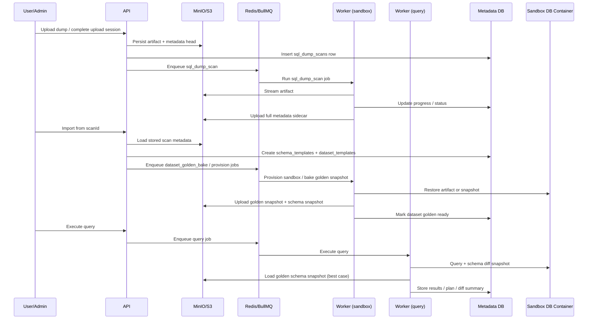

# Large Dump Review

## Mục tiêu
Bộ tài liệu này tách riêng luồng xử lý SQL dump lớn, golden snapshot, và kết nối giữa các service trong SQLForge.

Nó được viết để trả lời 3 câu hỏi thực dụng:

- Với dump vài GB thì hệ thống hiện tại chịu tải được tới đâu?
- Luồng nào đang đúng về mặt streaming nhưng vẫn còn rủi ro vận hành?
- Chỗ nào sai logic dữ liệu giữa các service, cần sửa trước khi scale?

## Phạm vi

- upload và scan dump
- import từ scan thành schema/dataset template
- provision sandbox từ artifact hoặc golden snapshot
- bake golden snapshot và schema snapshot
- kết nối `api`, `worker`, `worker-query`, `redis`, `postgres`, `minio`, Docker daemon

## Bản đồ tài liệu

1. [01-upload-and-scan-flow.md](./01-upload-and-scan-flow.md)
   Đi sâu luồng upload, normalize, scan head, scan async row-count, và các vấn đề quanh artifact nén.
2. [02-import-and-provision-flow.md](./02-import-and-provision-flow.md)
   Phân tích từ `scanId` sang dataset template, rồi sang sandbox restore thật sự.
3. [03-golden-snapshot-flow.md](./03-golden-snapshot-flow.md)
   Mổ xẻ pipeline bake snapshot, bottleneck disk/timeout, và hành vi với dump vài GB.
4. [04-service-connectivity.md](./04-service-connectivity.md)
   Ghi rõ service nào nói chuyện với service nào bằng cơ chế gì, và các điểm connect hiện đang mong manh.

## Luồng tổng thể

## Kết luận nhanh

- Luồng restore `.sql` và `.sql.gz` cho PostgreSQL, MySQL/MariaDB, và SQL Server hiện đã đi theo hướng streaming nên không còn phụ thuộc tuyệt đối vào RAM worker.
- Luồng upload session cho artifact nén hiện chưa canonicalize artifact trước khi persist final object; đây là issue logic nặng nhất vì scan và restore đang nhìn cùng một file theo hai cách khác nhau.
- Golden snapshot xử lý được dataset lớn nếu host đủ khỏe, nhưng hiện bị chặn bởi temp disk và timeout tĩnh nhiều hơn là bởi bộ nhớ.
- `worker-query` đang phụ thuộc vào đường đọc object storage qua Docker CLI dù service này không sở hữu Docker socket; đây là vấn đề connect-service rõ ràng.

## Đọc theo thứ tự đề xuất

1. Đọc `01-upload-and-scan-flow.md` để hiểu artifact đi vào hệ thống thế nào.
2. Đọc `02-import-and-provision-flow.md` để thấy format artifact ảnh hưởng restore ra sao.
3. Đọc `03-golden-snapshot-flow.md` để đánh giá tính chịu tải với dump vài GB.
4. Đọc `04-service-connectivity.md` để chốt phần wiring giữa các service và runtime dependency.
